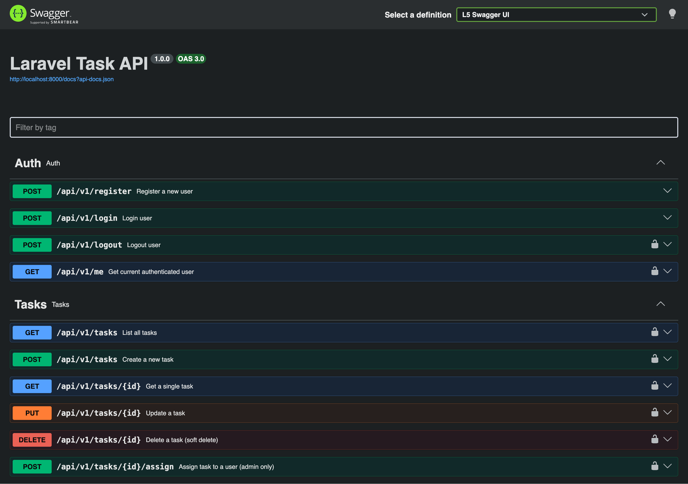
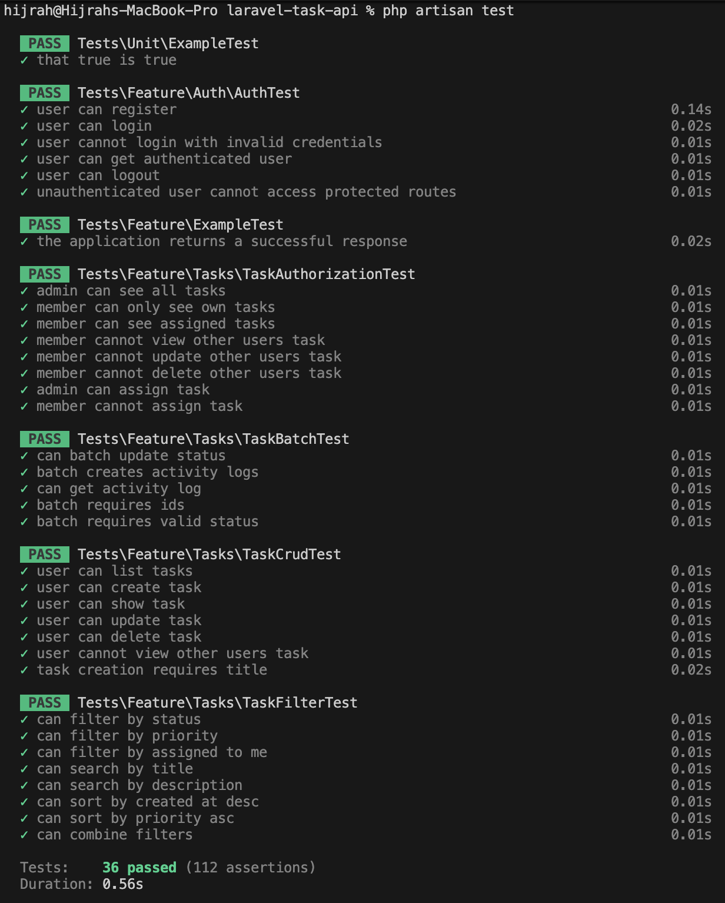

# Laravel Task API


A production-ready REST API built with Laravel 13, featuring token authentication,
role-based access control, task management with audit trail, and full test coverage.

## Tech Stack
Laravel 13 · PHP 8.4 · MySQL · PHPUnit · Sanctum · Docker · GitHub Actions

## Features
- Token-based authentication (Laravel Sanctum)
- Role-based access control (admin / member)
- Task management with status workflow & priority
- Soft deletes & activity logs (audit trail)
- Advanced filtering, sorting, and search
- Batch operations
- Request validation & API Resources
- Swagger/OpenAPI documentation
- Dockerised local environment
- CI: automated tests on every push (36 tests)

## Screenshots

### Swagger API Documentation


### Test Results


## Quick Start

```bash
git clone https://github.com/hijrahassalam/laravel-task-api.git
cd laravel-task-api
cp .env.example .env
docker-compose up -d
docker-compose exec app composer install
docker-compose exec app php artisan key:generate
docker-compose exec app php artisan migrate --seed
```

API available at `http://localhost:8000`

## Seed Accounts

| Email | Password | Role |
|-------|----------|------|
| admin@example.com | password | admin |
| john@example.com | password | member |
| jane@example.com | password | member |
| bob@example.com | password | member |

## Running Tests

Tests use SQLite in-memory (no MySQL needed):

```bash
php artisan test
```

Or with PHPUnit directly:

```bash
vendor/bin/phpunit
```

## API Endpoints

| Method | Endpoint | Auth | Description |
|--------|----------|------|-------------|
| GET | /api/v1/health | No | Health check |
| POST | /api/v1/register | No | Register |
| POST | /api/v1/login | No | Login |
| POST | /api/v1/logout | Yes | Logout |
| GET | /api/v1/me | Yes | Current user |
| GET | /api/v1/tasks | Yes | List (filter, sort, search) |
| POST | /api/v1/tasks | Yes | Create task |
| GET | /api/v1/tasks/{id} | Yes | Get single task |
| PUT | /api/v1/tasks/{id} | Yes | Update task |
| DELETE | /api/v1/tasks/{id} | Yes | Soft delete |
| POST | /api/v1/tasks/{id}/assign | Yes | Assign task (admin) |
| PATCH | /api/v1/tasks/batch-status | Yes | Batch update status |
| GET | /api/v1/tasks/{id}/activity | Yes | Activity log |

## API Documentation

Swagger UI: `http://localhost:8000/api/documentation`

## Bruno Collection

Import the collection folder `bruno-collection/` into Bruno:

1. Open Bruno
2. Click "Open Collection"
3. Select the `bruno-collection` folder
4. Set environment `local`
5. Login first to get token, then set `token` variable

## Filter & Sort Examples

```
GET /api/v1/tasks?status=done&priority=high
GET /api/v1/tasks?sort=-created_at,priority
GET /api/v1/tasks?search=keyword
GET /api/v1/tasks?assigned_to=me
```

## License

MIT
